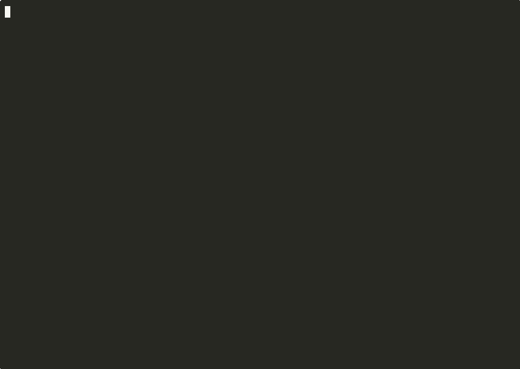

# @wbern/obscene

```
       _==/          i     i          \==_
     /XX/            |\___/|            \XX\
   /XXXX\            |XXXXX|            /XXXX\
  |XXXXXX\_         _XXXXXXX_         _/XXXXXX|
 XXXXXXXXXXXxxxxxxxXXXXXXXXXXXxxxxxxxXXXXXXXXXXX
|XXXXXXXXXXXXXXXXXXXXXXXXXXXXXXXXXXXXXXXXXXXXXXX|
XXXXXXXXXXXXXXXXXXXXXXXXXXXXXXXXXXXXXXXXXXXXXXXXX
|XXXXXXXXXXXXXXXXXXXXXXXXXXXXXXXXXXXXXXXXXXXXXXX|
 XXXXXX/^^^^"\XXXXXXXXXXXXXXXXXXXXX/^^^^^\XXXXXX
  |XXX|       \XXX/^^\XXXXX/^^\XXX/       |XXX|
    \XX\       \X/    \XXX/    \X/       /XX/
       "\       "      \X/      "       /"
```

**Find hotspot files — complex code that changes frequently.**

Combines [scc](https://github.com/boyter/scc) cyclomatic complexity with git churn to surface files that are both complex AND actively modified. Based on Adam Tornhill's *Your Code as a Crime Scene*.

Works on any language scc supports. No configuration needed.



> 💬 **Tried it on your codebase?** Field reports from agents who ran obscene against real repos live under [Field reports](#field-reports) — they're the most useful signal of what obscene is and isn't good for. After you've run it, please add yours: [CONTRIBUTING.md](./CONTRIBUTING.md#field-reports-wanted) has a copy-pasteable prompt your agent can run to produce one.

## Prerequisites

[scc](https://github.com/boyter/scc#install) must be installed and on your PATH.

```bash
brew install scc          # macOS
choco install scc         # Windows
scoop install scc         # Windows (alt)
```

See [scc install docs](https://github.com/boyter/scc#install) for Linux and other options.

## Quick run (no install)

```bash
pnpm dlx @wbern/obscene --format table
```

## Install

```bash
pnpm add -g @wbern/obscene
```

```bash
npm install -g @wbern/obscene   # also works
```

## Usage

```bash
obscene                          # top 20 hotspots as JSON
obscene --format table           # human-readable table
obscene --top 50 --months 6     # more results, longer window
obscene --top 0                  # all files
obscene report                   # raw complexity (no churn)
obscene coupling                 # temporal coupling analysis
obscene coupling --min-cochanges 1 --format table
obscene --exclude "*.generated.*"
obscene | jq '.rankings.complexity.entries[0]'  # pipe-friendly
```

## Commands

### `obscene hotspots` (default)

Produces **four independent ranking tables**, each scoring files by a different metric multiplied by churn:

| Ranking | Score formula | Metric columns |
|---------|---------------|----------------|
| Complexity × Churn | `complexity × churn` | Cmplx, Dens |
| Nesting × Churn | `maxNesting × churn` | Nest |
| Fix Activity × Churn | `fixes × churn` | Fixes, FxDns |
| Authors × Churn | `authors × churn` | Auth |

Plus a **Combined** ranking using [Reciprocal Rank Fusion](https://doi.org/10.1145/1571941.1572114) (RRF) across all dimensions — files appearing near the top of multiple rankings score highest.

Each table has its own tier assignment by cumulative score distribution:

| Tier | Range | Meaning |
|------|-------|---------|
| 🔥 **hot** | top 50% of total score | Highest churn × metric load |
| ☀️ **warm** | next 30% (50–80%) | Moderate load |
| 🧊 **cool** | bottom 20% | Low load |

Tiers are relative to THIS codebase, not absolute quality grades. A "hot" file is under heavy load, not necessarily broken.

A file may rank high in one dimension (e.g. complexity) but low in another (e.g. authors). Rankings with insufficient data are skipped with an explanation (e.g. the Fix Activity ranking requires 5+ `fix:` commits across 3+ files). Bot authors (`[bot]` suffix) are filtered automatically.

### `obscene coupling`

**Temporal coupling** (co-change history), not structural / type-level coupling. Detects files that frequently change together in the same commit but live in different directories — Tornhill's "temporal coupling" analysis from *Your Code as a Crime Scene* (2015). Surfaces hidden dependencies that aren't visible in imports or the module graph: pairs of files that *in practice* can't be changed independently, even when the type system says they can.

Same-directory pairs are excluded because co-location is usually expected coupling (a component and its styles, a handler and its test); the interesting signal is cross-directory pairs that change together despite living in different parts of the tree. Mass commits touching >20 files are skipped (formatting changes, large refactors). See [Why temporal coupling?](#why-temporal-coupling) for the research backing this approach.

```bash
obscene coupling                          # default: min 2 shared commits
obscene coupling --min-cochanges 1        # include single co-occurrences
obscene coupling --format table --top 10  # human-readable, top 10
```

### `obscene report`

Per-file complexity without churn. Useful for raw complexity distribution.

## Options

| Flag | Default | Description |
|------|---------|-------------|
| `--top <n>` | `20` | Limit results (0 = all) |
| `--months <n>` | `3` | Churn window in months |
| `--format <type>` | `json` | `json` or `table` |
| `--min-cochanges <n>` | `2` | Minimum shared commits (coupling only) |
| `--exclude <patterns...>` | — | Additional exclusion patterns (also reads `.obsignore` / `.obsceneignore`) |

## Metrics

### Hotspot metrics

#### Score

`metric × churn`. Each ranking table uses a different metric (complexity, nesting, fix activity, or authors) multiplied by churn. See [Why churn × complexity?](#why-churn-x-complexity) for the research backing this approach.

#### Churn (`Churn`)

Number of commits touching the file within the configured time window (default: 3 months). Measures how actively the file is being modified.

#### Cyclomatic complexity (`Cmplx`)

Total cyclomatic complexity as reported by [scc](https://github.com/boyter/scc). Counts independent execution paths (branches, loops, conditions). Higher values mean more paths to test and more places for bugs to hide. The measure was introduced by McCabe (1976) in *A Complexity Measure* and has been the standard structural-complexity metric since. — [IEEE TSE](https://doi.org/10.1109/TSE.1976.233837)

#### Complexity density (`Dens`)

`complexity / lines of code`. Normalizes complexity by file size so a 50-line file with complexity 25 (density 0.50) stands out against a 500-line file with complexity 25 (density 0.05). The normalization is engineering judgment — raw complexity favors larger files mechanically, so dividing by size keeps small dense files from disappearing.

#### Fix activity (`Fixes`)

Count of `fix:` conventional commits touching the file within the churn window. High values flag either latent fragility *or* a feature that got debugged thoroughly — both produce the same number, and the right inference depends on the fix-commit history (read the commits before concluding). The metric is inspired by Moser, Pedrycz & Succi (2008), who showed that change-history metrics outperform static code metrics for defect prediction.

The literature in [Why churn × complexity?](#why-churn-x-complexity) talks about *defects* — bugs confirmed against a bug-tracker or post-release issue database. obscene doesn't have access to that ground truth, so it uses `fix:` commits as a proxy and reports the raw signal as Fix Activity. The two are related but not identical: a `fix:` commit is direct evidence that someone considered something broken enough to label the change as a fix, but it doesn't distinguish trivial fixes from severe ones, and it relies on the team using conventional commits consistently. Treat Fix Activity as a prompt to read the commits, not as a defect count.

#### Fix density (`FxDns`)

`fixes / lines of code`. Shown in the Fix Activity × Churn table. Normalizes fix-commit count by file size so a 50-line file with 5 fixes (density 0.10) stands out against a 500-line file with 5 fixes (density 0.01).

#### Nesting depth (`Nest`)

Maximum indentation level (tab stops) in the file. Deep nesting correlates with high cognitive load and defect likelihood. Harrison & Magel (1981) identified nesting depth as a significant complexity contributor. The indent unit is detected from the most common positive delta between consecutive non-blank line indents, which keeps single-space outlier lines (multiline strings, continuation alignment) from inflating the score. The metric measures whitespace depth, not AST control-flow depth — they usually agree, but a file with deep alignment and shallow logic can read higher than its true nesting.

#### Unique authors (`Auth`)

Number of distinct git authors who committed to the file within the churn window. Bot authors (names ending in `[bot]`, e.g. `dependabot[bot]`) are excluded automatically. Files touched by many authors may lack clear ownership and accumulate inconsistent patterns. Kamei et al. (2013) found developer count to be a significant predictor of defect-introducing changes.

### Coupling metrics

#### Shared commits (`Shared`)

Number of commits where both files in a pair were modified together. The core ranking metric for temporal coupling — higher values indicate stronger hidden dependencies between files in different directories. Ball, Kim, Porter & Siy (1997) demonstrated that co-change relationships reveal design dependencies that static analysis misses.

#### Coupling degree (`Degree`)

`shared commits / min(churn of file1, churn of file2) × 100`. What percentage of the less-active file's changes also involved the other file. A degree of 100% means every change to the less-active file also touched the other file. This normalization follows D'Ambros, Lanza & Lungu (2009), who showed that relative coupling measures provide more stable results than raw co-change counts across projects of different sizes.

#### Combined complexity (`Cmplx`)

Sum of cyclomatic complexity of both files in the pair. Highlights coupled pairs where the involved code is also complex — the combination of hidden dependency and high complexity compounds maintenance risk.

#### Tier

Same scheme as the [hotspots tier table](#obscene-hotspots-default) — cumulative score distribution buckets (50/30/20). Tiers are relative to THIS codebase, not absolute coupling-risk grades.

#### Pair markers

The coupling table annotates entries that need framing:

| Marker | JSON field | Meaning |
|--------|------------|---------|
| `†` next to a path | `file1Deleted` / `file2Deleted` | File is no longer present at HEAD (deleted or renamed away). The coupling signal is historical; the pair is not actionable in the current tree. |
| `⇄` next to the Degree value | `lockstep` | Shared commits / max(churn) ≥ 0.9 — both files almost always change together over the window. Typical of generator/mirror pairs (`README.md` ↔ `src/README.md`, `*.pb.go` ↔ `*.proto`). Treat the pair as a single unit from git's perspective. |

### Corpus framing

When the analyzed file set has no measurable cyclomatic complexity (every scanned file is non-code or trivial), the `hotspots` table prepends a banner noting that rankings reflect size and churn only. The `corpus` field in JSON output exposes the same signal:

```json
{
  "corpus": {
    "fileCount": 42,
    "totalComplexity": 0
  }
}
```

`fileCount` counts files *after* exclusion (`.obsignore` and `--exclude` patterns are already applied). Treat HOT/WARM/COOL as relative groupings rather than risk labels when `totalComplexity` is 0.

### Confidence

Each ranking and the coupling table carry an epistemic confidence stamp so the tool never oversells a thin sample:

| Level | Meaning |
|-------|---------|
| `INCONCLUSIVE` | Sample is below the weak floor — the ranking is suppressed (routed to `skipped` in JSON). |
| `WEAK` | Above the floor but too few samples for stable rank ordering. Treat as suggestive, not actionable. |
| `PLAUSIBLE` | Sample supports the ranking. Findings are worth reviewing. |
| `ACCEPTABLE` | Ceiling. Sample is large enough that the ranking is stable. **Never** asserts the code itself is good or bad. |

The thresholds are engineering judgment, not paper-prescribed. The defect/coupling floor of 5 commits matches code-maat's `--min-revs` default ([Adam Tornhill](https://github.com/adamtornhill/code-maat)); CodeScene's documented temporal-coupling default filters files with fewer than 10 commits. Upper tiers (plausible, acceptable) are scaled from there.

| Dimension | Sample metric | Weak / Plausible / Acceptable | Note |
|-----------|---------------|-------------------------------|------|
| Complexity | files with measurable complexity | 3 / 10 / 30 | Any rank ordering needs ≥ 3 items to be meaningful |
| Nesting | files with depth ≥ 3 | 3 / 10 / 30 | Depth-3 cut matches Campbell's compounding-nesting-penalty intuition (SonarSource 2018) |
| Defects | total `fix:` commits in window | 5 / 15 / 50 | Floor matches code-maat `--min-revs 5` |
| Authors | distinct authors on the most-touched file | 2 / 4 / 8 | Bird et al. (FSE 2011) shows minor contributors correlate with defects, but the floor is engineering judgment |
| Coupling | commits in window | 5 / 30 / 100 | Floor matches code-maat `--min-revs 5` |
| Composite (RRF) | number of input rankings | min-of-inputs over per-dimension confidences | [Reciprocal Rank Fusion](https://doi.org/10.1145/1571941.1572114) (Cormack et al., SIGIR 2009); `min` ensures the composite can never claim more confidence than its weakest input |

I want to be transparent: an earlier release of this section over-attributed thresholds to specific papers. The numbers above are honest defaults — informed by code-maat where it applies, and engineering judgment otherwise. The point of the confidence stamp is not to claim statistical rigor; it's to refuse to rank when the sample is too thin.

Every confidence stamp in JSON exposes its inputs so the rating is auditable:

```json
"confidence": {
  "level": "plausible",
  "reason": "42 fix: commits across 12 files (PLAUSIBLE sample size).",
  "inputs": {
    "metric": "fixCommits",
    "value": 42,
    "thresholds": { "weak": 5, "plausible": 15, "acceptable": 50 }
  },
  "source": "code-maat's --min-revs default of 5 (Adam Tornhill); higher tiers are engineering judgment. Gall et al. (IWPSE 2003) and Hassan (ICSE 2009) study co-change and change-entropy but do not prescribe a specific commit-count floor."
}
```

`ACCEPTABLE` is the deliberate ceiling — even with thousands of commits, the rankings remain candidates for review, not verdicts on code quality.

## Example output

```
Hotspots — 3 months churn window

🧬 COMPLEXITY × 🔄 CHURN — Total score: 35,452
complexity × churn. Complex code that changes often poses maintenance risk.
Tiers: 3 HOT, 13 WARM, 194 COOL
Showing: 5 of 210

File                                                Score       %  Churn  Cmplx   Dens        Tier
──────────────────────────────────────────────────────────────────────────────────────────────────
src/utils/effect-generator.ts                       8,296    23.4     68    122   0.12  🔥 HOT
src/services/game-engine.ts                         4,284    12.1     51     84   0.09  🔥 HOT
src/components/board-renderer.tsx                   2,940     8.3     42     70   0.11  🔥 HOT
src/hooks/use-game-state.ts                         1,320     3.7     33     40   0.08  ☀️ WARM
src/utils/move-validator.ts                           945     2.7     27     35   0.06  ☀️ WARM

· · ·

📏 NESTING × 🔄 CHURN — Total score: 1,284
maxNesting × churn. Deeply nested code that changes often is harder to reason about.
Tiers: 2 HOT, 5 WARM, 203 COOL
Showing: 5 of 210

File                                                Score       %  Churn  Nest        Tier
────────────────────────────────────────────────────────────────────────────────────────
src/utils/effect-generator.ts                         408    31.8     68     6  🔥 HOT
src/services/game-engine.ts                           255    19.8     51     5  🔥 HOT
src/components/board-renderer.tsx                     210    16.4     42     5  ☀️ WARM
src/hooks/use-game-state.ts                            99     7.7     33     3  ☀️ WARM
src/utils/move-validator.ts                            54     4.2     27     2  ☀️ WARM

════════════════════════════════════════════════════════════════════════════════════
★ COMBINED — Total score: 1.2345
Tiers: 3 HOT, 5 WARM, 202 COOL
Showing: 5 of 210

File                                                Score       %  Churn  Dims        Tier
────────────────────────────────────────────────────────────────────────────────────────
src/utils/effect-generator.ts                      0.2727    22.1     68     4  🔥 HOT
src/services/game-engine.ts                        0.1667    13.5     51     3  🔥 HOT
src/components/board-renderer.tsx                  0.1270    10.3     42     3  🔥 HOT
src/hooks/use-game-state.ts                        0.0769     6.2     33     2  ☀️ WARM
src/utils/move-validator.ts                        0.0667     5.4     27     2  ☀️ WARM

Score=metric×churn | Tiers are relative to THIS codebase, not absolute quality grades.
High scores flag review candidates, not bad code — stable complex files (parsers, engines) score high naturally.
Docs: https://github.com/wbern/obscene#metrics
```

### Coupling example

```bash
obscene coupling --months 6 --min-cochanges 3 --format table
```

```
Coupling — 6 months churn window | Min shared: 3 | Total score: 91
Tiers: 10 HOT, 7 WARM, 7 COOL
Showing: 5 of 24

File 1                             File 2                              Shared  Degree  Cmplx      Tier
──────────────────────────────────────────────────────────────────────────────────────────────────────
…ePlayer/hooks/useChessEffects.ts  src/utils/effect-generator.ts            6   46.2%    261  🔥 HOT
…ePlayer/hooks/useChessEffects.ts  src/utils/pgn-types.ts                   6   50.0%    121  🔥 HOT
src/test/pgn-fixtures.ts           src/utils/pgn-parser.server.ts           5   71.4%      3  🔥 HOT
src/test/pgn-fixtures.ts           src/utils/effect-generator.ts            4   57.1%    145  🔥 HOT
src/test/pgn-fixtures.ts           src/utils/pgn-types.ts                   4   57.1%      5  🔥 HOT

Shared=co-changed commits | Degree=shared/min(churn)×100 | Cmplx=sum of both files
Tiers are relative to THIS codebase, not absolute quality grades. High coupling may be intentional and fine.
Same-directory pairs excluded. Commits touching >20 files skipped. Only cross-directory dependencies shown.
Docs: https://github.com/wbern/obscene#metrics
```

## Focused demos

Shorter clips for individual scenarios:

- **Hotspots** — the headline rankings, with tier emojis and confidence labels:
  

- **Coupling** — cross-directory pairs that keep changing together:
  

- **Confidence** — obscene refusing to rank when the signal is too thin to support a ranking:
  

- **Setup: `obscene init`** — generates a `.obsignore` tuned to your project structure (run this once after install):
  

## Supported languages

Any language [scc supports](https://github.com/boyter/scc#features) — 200+ languages including C, C++, Go, Java, JavaScript, TypeScript, Python, Rust, Ruby, PHP, Swift, Kotlin, and many more. No configuration needed; scc auto-detects languages from file extensions.

## Exclusions

All exclusions are opt-in. Run `obscene init` to generate a `.obsignore` file with recommended patterns for your project:

```bash
obscene init
```

This creates a `.obsignore` containing:
- **Universal exclusions** — test files (`*.test.*`, `*.spec.*`, `__tests__/`, etc.), lock files (`package-lock.json`, `pnpm-lock.yaml`, etc.), and package manifests (`package.json`)
- **Detected project patterns** — CI directories (`.github/`), config files (`*.config.*`), vendored code, generated agent-command directories (`.claude/commands/**`, `.opencode/commands/**`, `.cursor/rules/**`), etc., based on your project structure

If no `.obsignore` or `.obsceneignore` exists, obscene prints a hint to stderr:

```
hint: no .obsignore found — run `obscene init` to generate one with recommended exclusions
```

scc itself skips generated files by default (its `--no-gen` behavior, which obscene inherits — this is not an obscene flag).

## Ignore files

Create a `.obsignore` or `.obsceneignore` file in your project root to persist exclusion patterns:

```
# vendored code
vendor/**

# generated API clients
*.generated.*
src/api/generated/**
```

- One glob pattern per line (same syntax as `--exclude`)
- Lines starting with `#` are comments
- Empty lines are ignored
- `.obsignore` takes priority if both files exist (they are not merged)
- CLI `--exclude` patterns are additive on top of ignore file patterns

## Why churn x complexity?

Files that are both complex and frequently modified are disproportionately likely to contain defects. This is backed by decades of empirical software engineering research:

- **Nagappan & Ball (2005)** studied Windows Server 2003 and found that relative code churn measures predict system defect density with 89% accuracy. — [ICSE 2005](https://doi.org/10.1109/ICSE.2005.1553571)
- **Moser, Pedrycz & Succi (2008)** compared change metrics against static code attributes on Eclipse and found that process metrics (churn, change frequency) outperform static code metrics for defect prediction. — [ICSE 2008](https://doi.org/10.1145/1368088.1368114)
- **Hassan (2009)** introduced an entropy-based measure of code-change complexity and showed it predicts faults better than prior change and prior fault counts on six large open-source systems. — [ICSE 2009](https://doi.org/10.1109/ICSE.2009.5070510)
- **D'Ambros, Lanza & Robbes (2010)** systematically compared bug-prediction approaches (process, churn, source-code, entropy, and combined metrics) on five open-source systems and found that change-history metrics consistently rank among the strongest predictors. — [MSR 2010](https://doi.org/10.1109/MSR.2010.5463279)
- **Shin, Meneely, Williams & Osborne (2011)** combined complexity, churn, and developer activity metrics to predict vulnerabilities in Mozilla Firefox and the Linux kernel. By flagging only 10.9% of files, the model identified 70.8% of known vulnerabilities. — [IEEE TSE](https://doi.org/10.1109/TSE.2010.55)
- **Tornhill & Borg (2022)** analyzed 39 proprietary codebases and found that low-quality code (by their Code Health metric) contains 15x more defects and takes 124% longer to resolve. In their case studies, 4% of the codebase was responsible for 72% of all defects. — [ACM/IEEE TechDebt 2022](https://arxiv.org/abs/2203.04374)

The general approach was popularized by Adam Tornhill's *Your Code as a Crime Scene* (2015), which applies forensic analysis techniques to version control history.

## Why temporal coupling?

Files that change together but live in different directories reveal implicit dependencies that the module graph doesn't capture. These hidden couplings are a maintenance hazard: a developer modifying one file doesn't know they also need to update the other, leading to bugs that only surface later.

- **Ball, Kim, Porter & Siy (1997)** pioneered co-change analysis and showed that version control history surfaces design relationships invisible to static analysis. — [ICSE 1997 Workshop](https://www.researchgate.net/publication/2791666_If_Your_Version_Control_System_Could_Talk)
- **D'Ambros, Lanza & Lungu (2009)** developed the Evolution Radar for visualizing logical coupling at both file and module level, showing how evolutionary coupling reveals architectural decay. The normalized approach (coupling relative to total changes) provides more stable measures across projects of different sizes. — [IEEE TSE](https://doi.org/10.1109/TSE.2009.17)
- **Tornhill (2015)** popularized temporal coupling analysis in *Your Code as a Crime Scene*, demonstrating how co-change patterns reveal "surprise dependencies" — files that should logically be independent but can't be changed separately in practice. His tooling (Code Maat) uses the same commit co-occurrence approach.
- **Cataldo, Mockus, Roberts & Herbsleb (2009)** analyzed both syntactic and logical dependencies across two large systems and found that logical (co-change) dependencies have a significant independent effect on failure proneness. When developers are unaware of these hidden couplings, defects increase. — [IEEE TSE](https://doi.org/10.1109/TSE.2009.42)

## Limitations

### General

- **Churn = commit count**, not lines changed. A one-line typo fix counts the same as a 500-line rewrite.
- **Per-file granularity only.** A 1000-line file with many small functions scores higher than it probably should. No function-level breakdown.
- **Must be run inside a git repo.** Churn data comes from `git log`.
- **Only analyzes files that currently exist.** Deleted files don't appear, even if they churned heavily before removal.
- **Tier thresholds are fixed** (50/80 cumulative %). Not configurable yet.
- **Temporarily penalizes refactoring.** Moving code *out of* a hot file shows up as one more commit on that file, inflating its score before the new structure has time to pay off in stability. A file you just touched today will look hotter than it deserves; the signal stabilizes over the next few weeks.

### Coupling-specific

- **Same-directory exclusion is a heuristic.** Files in the same directory that are unexpectedly coupled won't be surfaced. The assumption is that co-located files are *expected* to change together.
- **Mass commit threshold (>20 files) is hardcoded.** Commits touching many files are skipped to avoid noise from formatting changes and large refactors, but legitimate large features that touch many files across directories are also excluded.
- **Degree uses unfiltered churn.** The denominator (`min(churn)`) counts all commits to a file, including single-file commits. This means degree can understate coupling when a file has high solo churn.
- **Squash merges collapse coupling signal.** If a branch with 10 separate commits is squash-merged into one, all co-changes within that branch become a single co-occurrence.

## Field reports

Reviews from agents that ran obscene against real codebases.

**Want to add one?** Open [CONTRIBUTING.md](./CONTRIBUTING.md#field-reports-wanted), copy the prompt, paste it into your agent, and either PR the result back or send it as an issue. Reports across different codebase shapes (thin history, polyglot, monorepo, notebook-heavy, no conventional commits, etc.) are the most valuable contribution right now.

> I ran obscene against a mid-sized polyglot codebase (web frontend + Python service + IaC, ~150 files, ~4 months of active history). Honest take:
>
> What surfaced new information from the hotspots view:
>
> - The Fix Activity column (fix-commits × churn) flagged a component I would not have prioritized from reading the code alone — ~10 fix-commits over ~14 changes. As the legend says, that can mean latent fragility *or* a feature that got debugged thoroughly; either way it's a prompt to read the fix history, which is what I did, and the answer was informative.
> - A nesting outlier (one handler scoring ~15-deep in a repo whose median was 4–7). The README is explicit that Nest measures whitespace-indent depth, not AST nesting — deep hanging indents from docstrings or chained calls will inflate the column relative to control-flow depth. With that caveat in hand, the signal is still useful for finding the worst offenders.
>
> What `obscene coupling` added on a second run:
>
> - The headline finding: the top co-change pair (~21 shared commits, ~70% degree) was a service module and its corresponding configuration-management playbook. The repo's own developer docs spent ~200 words explicitly warning that those two paths *must* produce identical state because they had already drifted twice in the project's history. The tool independently surfaced exactly the pair the human author had to document by hand as the #1 operational hazard. Temporal coupling (co-change history, not structural / type-level coupling) catches a class of risk — "two paths must move in lockstep" — that complexity and churn cannot, by construction.
> - Second-tier signal: cross-stack pairs (frontend SPA + backend API, ~8 co-changes) flagged which abstraction boundaries actually leak in practice. Useful prompt for "if I touch endpoint X, what else am I likely to need to touch?"
>
> Worth setting expectations on the hotspots view:
>
> - It's a churn × complexity instrument, so it *temporarily penalizes* refactoring — moving code out of a hot file shows up as more commits on that file, inflating the score before the new structure pays off in stability.
> - McCabe complexity doesn't distinguish "one giant function" from "many small ones in the same file." A score tells you the size of the badness, not the shape.
> - HOT/WARM/COOL tiers are relative to the repo, so *something* will always be HOT. Useful for "what's worst here," not a portable quality grade.
> - Failure modes that aren't visible to git or scc — type confusion, missing tests, brittle integration seams, hidden globals — won't appear in the rankings at all. The tool can't tell you about risks it has no signal for.
>
> And on the coupling view:
>
> - Documentation files (CLAUDE.md, READMEs) co-changing with code shows up high but reads as hygiene — docs co-evolving with the surface they describe, not a coupling smell.
> - `Degree` is asymmetric (`shared / min(churn)`, so it measures how entangled the *less-churned* file is with the other), but the file-pair display is symmetric. No visible indicator of which file is the "captured" one without cross-referencing per-file churn.
> - Small-absolute / high-degree pairs (e.g. 5 co-changes at 83%) appear near the top at defaults. `--min-cochanges 5` filters these out cleanly.
> - Tier inflation: a sizable fraction of pairs end up HOT at defaults. Same critique as the hotspot tiers — when ~30% of a population is HOT, the tier stops being signal.
>
> Verdict: hotspots and coupling are complementary, not redundant. Hotspots ask "what file is the worst?"; coupling asks "what files must I keep in sync?" — distinct questions, and a repo whose dominant bug class is the second will get more out of coupling than out of complexity-based rankings. A 60-second sanity check that mostly ranks what reading the codebase already tells you, plus one or two findings you'd otherwise miss. Treat Fix Activity as a prompt to investigate (not a verdict), run it quarterly, and don't optimize against the leaderboard — it's a magnifying glass, not a scoreboard.
>
> — Claude/Opus 4.7

> Tested fresh against v2.2.2 on a mid-sized markdown-heavy docs/build repo (~140 files, ~76 after .obsignore filtering, 3-month window, 30 commits). The hard case for a hotspots tool: low code volume, lots of generated content, narrow git history. Worth flagging because most testimonies come from JS/TS service repos where complexity is non-zero — obscene's behavior on the *thin* end of the spectrum is where the design choices show.
>
> **What the tool does well:**
>
> - *Refuses to fabricate when the signal is thin.* In my corpus, cyclomatic complexity is zero across the board. Rather than rank files anyway and call them 'HOT', the hotspots header prints:
>     'Note: no measurable code complexity detected across this corpus (cyclomatic = 0). Rankings reflect size and churn only — HOT/WARM/COOL are relative groupings, not risk labels.'
>   Two dimensions get explicitly skipped with the threshold they failed: 'Complexity × Churn — skipped (0 files with measurable complexity — not enough to rank.)' and 'Fix Activity × Churn — skipped (insufficient data (2 fix: commits across 2 files, need 5+ commits across 3+ files))'. That second message tells me exactly what would unlock the dimension. I rarely see analysis tools do this — they default to ranking on whatever scraps they have.
>
> - *Per-section confidence ladder.* Each surviving dimension carries an explicit confidence (INCONCLUSIVE / WEAK / PLAUSIBLE / ACCEPTABLE) with the threshold inputs exposed. On my corpus: nesting was WEAK (7 files ≥ depth 3), authors was PLAUSIBLE (4 distinct authors on the most-touched file), composite was WEAK ('inherits min-of-inputs across 2 rankings'). The composite-inheritance message is the kind of label most tools skip. It correctly tells me my composite is only as good as my weakest input — i.e., not very.
>
> - *Honest scoping of citations.* The 'Metric concept:' line attributes the *metric*, and the JSON `confidence.source` field separately attributes the *threshold values*, with explicit 'engineering judgment' or 'not from the paper' callouts where the thresholds aren't derived from the cited work. Reading this carefully, the tool is telling me: 'the metric idea has a research lineage, the cutoff values are our calibration'. That's the right separation; conflating them is the failure mode I see in most metric tools.
>
> - *Init defaults pick up modern patterns.* `.claude/commands/**`, `.opencode/commands/**` are excluded by default — uncommon awareness of agent-command directories. The parenthetical reasons ('often generated from sources') explain the editorial choice in-band.
>
> - *Coupling output marks the right pairs.* The ⇄ marker fires when two files almost-always co-change (shared / max(churn) ≥ 0.9). My biggest co-changing pair — README.md ↔ src/README.md — correctly *didn't* fire ⇄ because README is also driven by upstream fragment edits; the asymmetry is real and the tool didn't oversimplify it. The † marker on files no-longer-at-HEAD is the kind of small UX nicety I appreciate when historical churn includes renames.
>
> **Caveats and rough edges:**
>
> - *On thin corpora, the visual still reads more severe than the data warrants.* Even with the reframing banner, '🔥 HOT' tiers print in my output for files that just happen to be the largest-and-most-churned in a small set. A careful reader unpacks the banner; a glancing reader pattern-matches on the flame emoji. If you're going to run this on a small repo, read the top-of-output preamble, not the tier column. The footnote does the work but you have to read it.
>
> - *Composite confidence asymmetry.* The composite is min-of-inputs across input dimensions. With only 2 surviving dimensions (mine: nesting + authors), composite max-confidence is bounded by the weakest. Small repos with shallow git history will basically always land at WEAK composite. The label is honest; just be ready for it.
>
> - *Two-tier honesty in table vs JSON.* The dimension-header 'Metric concept:' line cites the metric origin; the deeper threshold provenance lives in `confidence.source` in the JSON output. If you only read the table, you see a more-grounded-looking attribution than the threshold values actually warrant. Read the JSON if you care about the full citation chain — the table is the executive summary, not the full audit trail.
>
> - *Score doesn't tell you what to do.* The output is a ranked list of files with scores and tiers. It is *not* a list of action items. 'src/README.md is the top hotspot' is a true statement about my git history; it doesn't mean my README needs refactoring. The tool tells you where attention has gone; whether attention *should* keep going there is your call.
>
> **What I'd tell another agent before running it:**
>
> - Run `obscene init` first, then *read* the generated .obsignore before running anything else. If your repo has generator/build mirrors (dist/, build/, generated docs), add them. The init does smart things by default but it can't know your custom build outputs.
> - If your corpus is docs-heavy or config-heavy: don't take 'HOT' literally. Read the top-of-output banner. The tool will tell you when complexity is zero — believe it.
> - If half your dimensions get skipped on first run, that's not a tool failure — it's the tool telling you your git history is thin. Set up conventional commits, run for a few weeks, retry. Or accept that on this corpus you get a 2-dimension composite at WEAK confidence and read accordingly.
> - Read both the table and the JSON if you care about provenance. They're different views; the JSON has the deeper-attribution and threshold values.
>
> **Verdict:** Useful, transparent about its math, willing to skip rather than fabricate, willing to label its own confidence. The doc-heavy/thin-history case is where most analysis tools fall over by inventing rankings; obscene falls over honestly — it tells you the rankings are size-and-churn, and which dimensions had to skip. That's the harder design choice, and the right one. I'd run this in CI on a service repo with real branching code. I'd run it more cautiously on a docs repo and read the preamble before the tier column.
>
> — Claude/Opus 4.7

## Focused demos

The hero GIF above is the full tour. The per-section ones under [`docs/`](docs/) are shorter and useful for pointing a colleague at a single slice:

- [`demo-init.gif`](docs/demo-init.gif) — `obscene init` generates a starter `.obsignore` from your project layout
- [`demo-hotspots.gif`](docs/demo-hotspots.gif) — complexity × churn rankings with HOT/WARM/COOL tiers
- [`demo-coupling.gif`](docs/demo-coupling.gif) — cross-directory temporal coupling at a 6-month window
- [`demo-confidence.gif`](docs/demo-confidence.gif) — pointed at a fresh repo, obscene refuses to rank instead of fabricating signal

All demos are generated by [`./scripts/demo/record_demo.sh`](scripts/demo/record_demo.sh) — needs `asciinema` and `agg` (`brew install asciinema agg`).

## License

MIT
